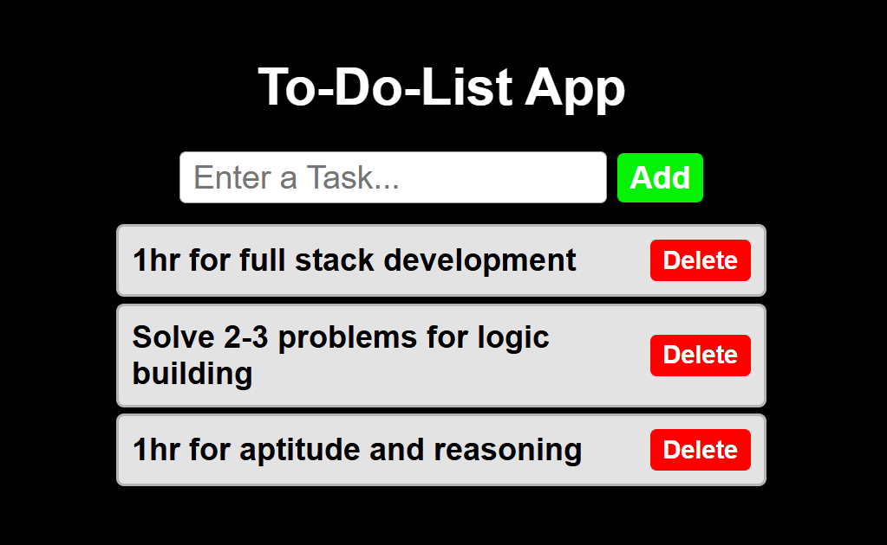

# To-Do-List App(React)
  A simple and responsive app **Todo List application** built using **React**.  
  This project helps users add and delete tasks with a clean UI that works well on **mobile, tablet, and laptop** screens and also iam easily understand how react hooks works well.
  
## Features
  ➕ Add new tasks
  🗑️ Delete tasks
  🚫 Prevent empty task submission
  📱 Responsive design (Mobile & Desktop)
  ⚡ Built with React Hooks

## 🛠️ Tech Stack
  👉React
  👉JavaScript (ES6)
  👉CSS3

## 📚 What I Learned
  📑React useState hook
  📑Handling user input events
  📑Rendering lists dynamically
  📑Responsive UI design using CSS Flexbox

# 📸Expected output
   

